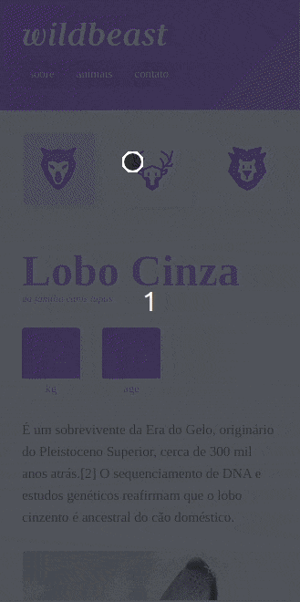
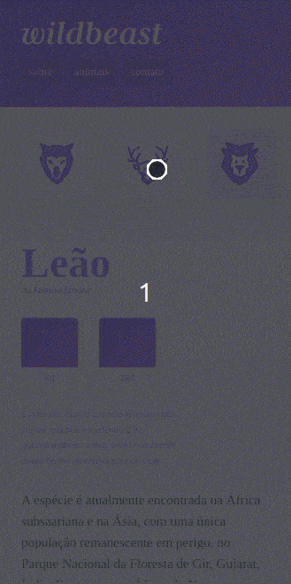

<h1 align="center">
    
</h1>

<p align="center">
  <a href="#-Sobre">Sobre</a>&nbsp;&nbsp;&nbsp;|&nbsp;&nbsp;&nbsp;
  <a href="#-tecnologias">Tecnologias</a>&nbsp;&nbsp;&nbsp;|&nbsp;&nbsp;&nbsp;<a href="#-Preview">Preview</a>&nbsp;&nbsp;&nbsp;|&nbsp;&nbsp;&nbsp;<a href="#-Teste">Teste</a>&nbsp;&nbsp;&nbsp;|&nbsp;&nbsp;&nbsp;<a href="#-Extra">Extra</a>&nbsp;&nbsp;&nbsp;|&nbsp;&nbsp;&nbsp;
  <a href="#-licença">Licença</a>
</p>
</br>
<h3 align="center" ><a href="https://bernardosv-wildbeast.netlify.app">Wildbeast Link</a></h3>

<br>

## 💻 Sobre

</br>
O wildbeast o projeto de conclusão do curso CSS Grid Layout da Origamid. O projeto foi construido inteiramente utilizando display grid.
</br>
</br>
O projeto do curso se limitava a apenas uma pagina, mas eu resolvi ir um pouco alem. Na sessão de Extra eu falo um pouco mais sobre. 
</br>
</br>

## 🚀 Tecnologias

</br>
Esse projeto foi desenvolvido utilizando as seguintes tecnologias:
</br>

</br>

- [HTML5](https://developer.mozilla.org/pt-BR/docs/Web/HTML/HTML5)
- [CSS](https://www.w3schools.com/css/)
- [Javascript](https://developer.mozilla.org/pt-BR/docs/Web/JavaScript)

  </br>

## 🔍 Preview

</br>
<p align="center">
   &nbsp;
  
</p>

Projeto desenvolvido durante a **[Next Level Week](https://nextlevelweek.com/)**, realizada pela **[@Rocketseat](https://github.com/Rocketseat)**.
</br>
</br>

## 🧪 Teste

</br>

[Clique aqui](https://bernardosv-wildbeast.netlify.app) para ver o projeto no seu navegador, ou siga os seguintes passos para testar no seu proprio servidor:

```
- Clone o repositório:
$ git clone https://github.com/BernardoSV/wildbeast.git

- Abra no seu VSCode e rode o live server:
$ cd wildbeast
$ code .
$ Abrir Live Server :P
```

  </br>

## 🏗️ Extra

</br>
<p align="center">
   &nbsp;
  
</p>
</br>

## 📝 Licença

</br>

[MIT - LICENSE](LICENSE.md)

---

<p align="center">Feito com  💜 por Bernardo Stogmuller</p>
<p align="center">Origamid 🐺</p>
